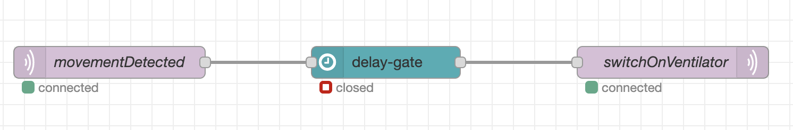

# Delay Gate
Is node-red node that can be used to pass messages only after certain delay period since the initial "trigger message" has passed.

After the initial delay the gate can either stay open until the closing timer expires or be closed immediately after the first message is forwarded.

## Valid message
Unless specified, all input messages to the node are considered valid. Optionally you can make the node react to only messages with specific `msg.payload` value and type. Payload type and value can be specified in node properties. When `payload` value has been configured in node settings all other messages are considered invalid.
## Behaviour
The node has three states:

- closed state
- delay state
- open state

Initially the node is in __closed state__.

When the first valid message is received the node enters __delay state__ and starts delay timer. During the delay state all valid messages are ignored. When invalid message is received during the delay state the delay is cancelled and the node returns to __closed state__.

When the delay period has passed the node enters __open state__ and the next valid message will be passed to gate output.

In case the node is configured to close the gate immediately after passing the message the gate returns to __closed state__ after passing the first message. Otherwise it stays open for valid messages until the gate open period has passed. In case invalid message is received during that time the gate returns to __closed state__ immediately.

## Practical example
Let's say you have a movement sensor in a room and you want to switch on an appliance, for example a ventilator, when the movement is detected. However you want to do that only after somebody moves in a room for a longer period of time so occasional short movement in a room would not switch on the appliance.

